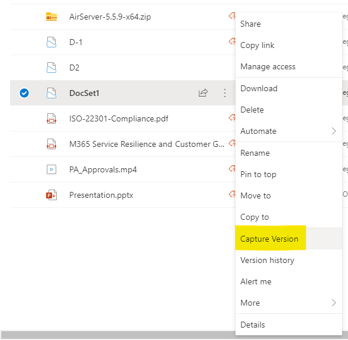

Using SharePoint Online CSOM to Capture Versions of Document Sets 
=================================================================

With the latest release of SharePoint Online Client Components aka CSOM (Client-Side Object Model) (version: 16.1.20317.12000 or above), we now support methods to capture versions of Document Sets in SharePoint Online document libraries. It might surprise some of you, but before this CSOM release, there was no way to automatically or programmatically capture versions of Document Sets. It has to be done manually through the ribbon or the ECB menu. This is true for both the classic and modern sites in both SPO and On-Premises. See below screenshot of the ECB menu to capture a version:



This API is now made access to public through the latest CSOM release. Glad to share that I personally worked on a Design Change Request (DCR) to get this approved from Product Group. DCR is our internal process to make a business justification with enough evidence that a certain feature is needed/modified etc. That's one of the many ways Product Group takes feedback from field broadening our impact in this role as a Premier Field Engineer (or Customer Engineer).

Here are short snippets of C# sample code that shows how the CSOM code works.

Below are the links to the PowerShell scripts for reuse:

Start with basic CSOM: Authenticate and then get a site title.
```csharp
string userName = "userid@Contoso.OnMicrosoft.com";
SecureString password = ConvertToSecureString("secretpassword");
var ctx = new ClientContext("https://Contoso.sharepoint.com/sites/ModernTeamSite");
ctx.Credentials = new SharePointOnlineCredentials(userName, password);
ctx.Load(ctx.Web);
ctx.ExecuteQuery();
Console.WriteLine(ctx.Web.Title);
```

Now that you have your ClientContext object ready. You can now request all the Document Set items from the library. Then request the version collection for each document set item.
```csharp
var list = ctx.Web.Lists.GetByTitle("Documents");
//Use below two lines if you want to load a specific item by id
//var item = list.GetItemById(26);
//ctx.Load(item, l=>l.ContentType);
var query = new CamlQuery()
{
    ViewXml = String.Format("<View><Query><Where><Eq><FieldRef Name='ContentType' /><Value Type='Computed'>Document Set</Value></Eq></Where></Query></View>")
};
ListItemCollection items = list.GetItems(query);
ctx.Load(items);
ctx.ExecuteQuery();

foreach (var item in items)
{
    Console.WriteLine("Item id: "+ item.Id);
    var folder = item.Folder;
    ctx.Load(folder);
    var ds = Microsoft.SharePoint.Client.DocumentSet.DocumentSet.GetDocumentSet(ctx, folder);
    ctx.Load(ds);
    var dsVersions = ds.VersionCollection;
    ctx.Load(dsVersions);
    ctx.ExecuteQuery();
    Console.WriteLine("Version count: "+ dsVersions.Count);
}
```

To add a new version aka capture version of a document set:
```csharp
//Add new version. First parameter signifies whether to capture items within docset with their major or minor versions checked in. Second parameter is a string/comment.
dsVersions.Add(true, "capture new version thru CSOM");
```

To get contents of a captured version of a Document set along with the site columns (fields) for the library.
```csharp
List<Microsoft.SharePoint.Client.DocumentSet.DocumentSetVersionItem> itemsWithinDS = (List<Microsoft.SharePoint.Client.DocumentSet.DocumentSetVersionItem>)dsVersions[0].GetDisplayContents();
List<Microsoft.SharePoint.Client.DocumentSet.DocumentSetVersionField> fields = (List<Microsoft.SharePoint.Client.DocumentSet.DocumentSetVersionField>)dsVersions[0].GetDisplayFields();
ctx.ExecuteQuery();
Console.WriteLine("Contents count: " + itemsWithinDS.Count);
Console.WriteLine($"Field title: {fields[0].Title}, Value: {fields[0].FormattedValue}");
```

Do not forge to dispose of your ClientContext object :)
```csharp
ctx.Dispose();
```

I also have the PowerShell script posted on my [GitHub Gist](https://gist.github.com/svarukala/7e453f8bf0868d8b90b11f3612df83bc) account. It showcases how to get all Document Set items, capture versions, enumerate contents and the fields. Here is the full PowerShell script:

```powershell
cls 
#Import-Module Microsoft.Online.SharePoint.PowerShell
Add-Type -Path "C:\Program Files\Common Files\Microsoft Shared\Web Server Extensions\16\ISAPI\Microsoft.SharePoint.Client.dll"
Add-Type -Path "C:\Program Files\Common Files\Microsoft Shared\Web Server Extensions\16\ISAPI\Microsoft.SharePoint.Client.Runtime.dll"
Add-Type -Path "C:\Program Files\Common Files\microsoft shared\Web Server Extensions\16\ISAPI\Microsoft.SharePoint.Client.DocumentManagement.dll"

#Setting this to True will create new version for any DocSet it identifies that has zero versions existing
$CreateNewVersion = $true
$AdminPass = "password"
$AdminPassword = ConvertTo-SecureString -string $AdminPass -AsPlainText -Force
#$AdminPassword=Read-Host -Prompt "Enter password" -AsSecureString
$username="MeganB@YourTenant.OnMicrosoft.com"
$Url="https://YourTenant.sharepoint.com/sites/ModernTeamSite"
$ListTitle="Documents"
$ctx=New-Object Microsoft.SharePoint.Client.ClientContext($Url)
$ctx.Credentials = New-Object Microsoft.SharePoint.Client.SharePointOnlineCredentials($Username, $AdminPassword)
$ctx.Load($ctx.Web)
$ctx.ExecuteQuery()
$list=$ctx.Web.Lists.GetByTitle($ListTitle)
$ctx.Load($list)
$ctx.ExecuteQuery() 

"Document Library: "+ $ListTitle
"Total Item Count: "+ $list.ItemCount 

$spqQuery = New-Object Microsoft.SharePoint.Client.CamlQuery 
$spqQuery.ViewXml = "<View><Query><Where><Eq><FieldRef Name='ContentType' /><Value Type='Computed'>Document Set</Value></Eq></Where></Query></View>";
#$spqQuery.v .ViewFields = "<FieldRef Name='FileLeafRef' /><FieldRef Name='Title' />" 
#$spqQuery.ViewFieldsOnly = $true 

$items = $list.GetItems($spqQuery) 
$ctx.Load($items)
$ctx.ExecuteQuery() 

write-host "Found (" $items.Count ") DocumentSet content type items."
write-host ""
foreach ($splListItem in $items) 
{ 
    write-host "Id: " $splListItem.Id " ," "Title:" $splListItem["Title"] -ForegroundColor Green 

    $folder = $splListItem.Folder;
    $ctx.Load($folder);
    $ctx.ExecuteQuery() 
    $docSetItem = [Microsoft.SharePoint.Client.DocumentSet.DocumentSet]::GetDocumentSet($ctx, $folder)
    $ctx.Load($docSetItem)
    $ctx.ExecuteQuery()
    $docSetItemVersions = $docSetItem.VersionCollection
    $ctx.Load($docSetItemVersions)
    $ctx.ExecuteQuery()
    write-host "Total versions: " $docSetItemVersions.Count
    
    if($docSetItemVersions.Count -gt 0)
    {
        $docSetItemVersions | %{
            Write-Host "Fetching the version contents..." -ForegroundColor Yellow
            #$_ | Get-Member
            Write-Host "Version Id: "$_.VersionLabel ", Comment: " $_.Comments ", Created: " $_.Created ", By: " $_.CreatedBy
            #$versionContents = New-Object System.Collections.Generic.List[Microsoft.SharePoint.Client.DocumentSet.DocumentSetVersionItem]
            $versionContents = [System.Collections.Generic.List[Microsoft.SharePoint.Client.DocumentSet.DocumentSetVersionItem]]$_.GetDisplayContents();
            $fieldValues = [System.Collections.Generic.List[Microsoft.SharePoint.Client.DocumentSet.DocumentSetVersionField]]$_.GetDisplayFields();
            $ctx.ExecuteQuery()
            #Write-Host $versionContents[0]
            #$versionContents[0] | Get-Member
            write-host "Found (" $versionContents.Count ") items in this doc set verion:"
            $versionContents | %{ write-host "-- ItemUrl:" $_.ItemUrl ", VersionLabel:" $_.VersionLabel ", InternalId: " $_.InternalId}
            #$fieldValues.Count
            write-host "Field values found in this version:"
            $fieldValues | %{ Write-Host "-- Title: " $_.Title ", Value: "$_.FormattedValue }
            Write-Host ""
        }
    }
    else {
        $docSetItemVersions.Add($true, "v1")
        $ctx.ExecuteQuery()
    }
    write-host ""
    write-host ""
} 
 
$ctx.Dispose()
```