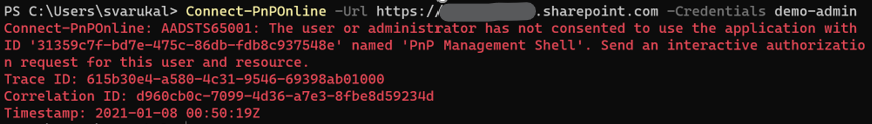
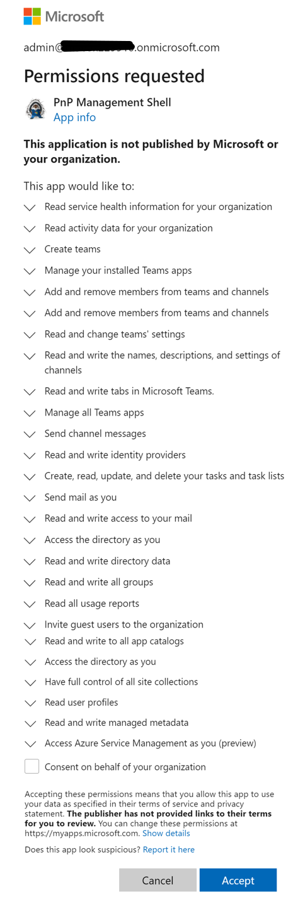
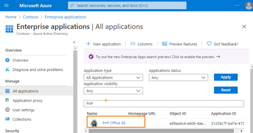
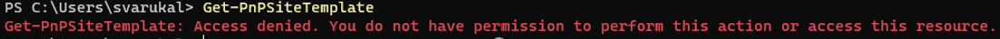

# Summary
The transition to the new PnP PowerShell for Microsoft 365 module should be smooth but if you see errors like 404 unauthorized or consent error, this blog might help you understand the underlying authentication mechanism behind PnP.PowerShell. Note that I cross posted this blog on [dev.to platform](https://dev.to/svarukala/introducing-the-new-pnp-powershell-based-on-net-core-3-1-and-learn-how-it-s-authentication-works-pn7) for better findability. 

# Introduction

Microsoft 365 Patterns and Practices (PnP) team published a new PowerShell module for M365 that runs on .NET Core 3.1/.NET Framework 4.6.1 and PowerShell Core v7.1. This means this module is platform agnostic. This also means the legacy SharePointPnPPowerShellOnline module will eventually be discontinued. The reason for this shift is well explained by [PnP PowerShell team](https://github.com/pnp/powershell). 

If you are wondering what is the best way to switch from SharePointPnPPowerShellOnline to Pnp.PowerShell, you got covered by bloggers like [Todd Klindt - also explains reason  for the switch](https://www.toddklindt.com/blog/Lists/Posts/Post.aspx?ID=881) and [Jeff Jones - bonus quick short video](https://www.spjeff.com/2021/01/03/how-to-switch-to-pnp-powershell-ps7-from-sharepointpnppowershellonline-ps5-1/).


# 
# PnP PowerShell Authentication with Service Principal

The transition to the new PowerShell module should be smooth but I am seeing some folks ([example](https://docs.microsoft.com/en-us/answers/questions/218696/pnp-error-when-connect-pnponline.html)) getting stuck with errors like this one:


>*Connect-PnPOnline : AADSTS65001: The user or administrator has not consented to use the application with ID
'31359c7f-bd7e-475c-86db-fdb8c937548e' named 'PnP Management Shell'. Send an interactive authorization request for this user and resource*

There are two pieces of information in this error that is relevant to this blog.
1. **31359c7f-bd7e-475c-86db-fdb8c937548e** <-- The application ID
2. **PnP Management Shell** <-- The name of the application 

One of the important changes is the way authentication works in the new module. The final step after installing the PnP.PowerShell module is to run this command:

***Register-PnPManagementShellAccess***

This PS command will create an Azure AD Enterprise Application (a service principal) with an ID (31359c7f-bd7e-475c-86db-fdb8c937548e) and the name of this application is "PnP Management Shell". You can navigate to your Azure Portal > Azure Active Directory > Enterprise Applications. You can see the app there.

Note: The same enterprise application with ID 31359c7f-bd7e-475c-86db-fdb8c937548e is also used by [CLI for Microsoft 365](https://pnp.github.io/cli-microsoft365/) too. 

This is a service principal with a fixed ID and name. 

**How does it have a fixed name/id and how is it different from Azure AD App registration?**

Consider contoso.onmicrosoft.com tenant is where a AAD App is registered with the ID (31359c7f-bd7e-475c-86db-fdb8c937548e) and name "PnP Management Shell". And this app is configured as a multi-tenant app. Sine this is multi-tenant app, whenever a user uses it the first time from a different tenant (say fabrikam.onmicrosoft.com), a corresponding service principal is created in the 'enterprise applications' section in their tenant with the same ID/Name. It's basically a projection of the app with the same permissions but requested and consented in the users (in this example its fabrikam.onmicrosoft) tenant. The Register-PnPManagementShellAccess command is doing exactly this. 

# 
# How to consent to minimal permissions for the PnP PowerShell Enterprise App

When you run the Register-PnPManagementShellAccess command, it will prompt you to consent to a large number of permissions. See picture below.


There is a way to take control on the permissions, minimize the permissions for the PnP PowerShell app for reasons like a shared environment or may be to use PnP PowerShell in Azure DevOps CICD pipeline. To do that instead of running the Register-PnPManagementShellAccess command, you need to create the Service Principal on your own and request the minimal permissions needed for your scenario. Here is an [Azure CLI script sample](https://gist.github.com/svarukala/1d0c07d1706e378f45f7d715844ba585):

```powershell
az login

$PnPPowerShellAppId = "31359c7f-bd7e-475c-86db-fdb8c937548e"

az ad sp create --id $PnPPowerShellAppId

#The guid 00000003-0000-0000-c000-000000000000 corresponds to Microsoft Graph
az ad app permission grant --id $PnPPowerShellAppId --api 00000003-0000-0000-c000-000000000000 --scope User.Read.All,Group.ReadWrite.All

#The guid 00000003-0000-0ff1-ce00-000000000000 corresponds to SPO
az ad app permission grant --id $PnPPowerShellAppId --api 00000003-0000-0ff1-ce00-000000000000 --scope User.Read.All,Sites.FullControl.All
```

# 
# Caveat with previously consented SharePointPnPPowerShellOnline app

If you've previously installed SharePointPnPPowerShellOnline and used it to log into your M365 tenant at some point, then that would have already created the Azure AD Enterprise app with the same ID but a different name ("PnP Office 365 Management Shell"). You can navigate to your Azure Portal > Azure Active Directory > Enterprise Applications to see the service principal.


In this case running Register-PnPManagementShellAccess can be optional. The cmdlets work just fine. But not all commands work. Here is an error for Get-PnPSiteTemplate for example:


To fix the above issue I ran the Register-PnPManagementShellAccess command but that didn't help. I had to delete the existing legacy enterprise app. To delete, you need to open the enterprise application, go to properties and select delete. Then run the Register-PnPManagementShellAccess command.

# 
# Use your own Azure AD App with PnP PowerShell

The steps to create your Azure AD App to use with PnP PowerShell is [documented here](https://pnp.github.io/powershell/articles/authentication.html). **However, based on my research and understanding, you can use it for App-Only access** (let me know if there is a way). To use with user login you have to use the service principal corresponding to PnP Management Shell.


# 
# Issue with uninstalling module in PowerShell Core 7.1

When I tried to uninstall a module using Uninstall-Module command, although it runs without any errors, the module actually is not deleted. When I navigate to the module locations, I can see the folder corresponding to the module. To check the PS Module Path you can run the command **$env:PSModulePath**.
I had to manually delete the module folder to get rid of the module. This might be an isolated issue but calling it out here if anyone hits that issue.

Happy scripting!

Hope that helps!