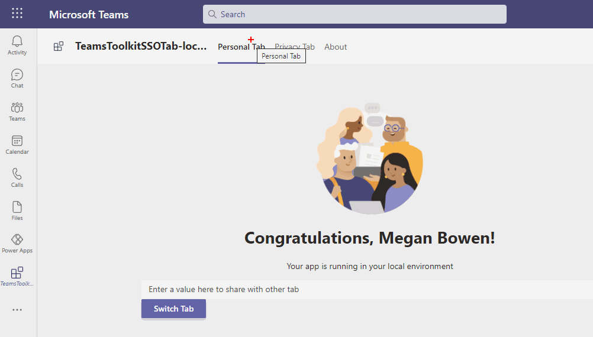

# Summary
Microsoft Teams apps utilize tabs for the user interface elements. One common ask from customers see to be a way to share data between tabs. Say, user is in home tab, clicks a tile and is expecting to switch to another tab showing details of that tile. This post is about how to achieve this scenario using MS Teams personal app.

# Details
This sample teams app is built using VS Teams Toolkit v2. It showcases how to switch from one tab to other while passing data to the destination tab. Please see this GIF in action:

I published the MS Teams app on  [GitHub](https://github.com/svarukala/TeamsToolkitCrossTabDataShare). I will further expand this blog post full details and especially if there is interest from the community.

Hope that helps!