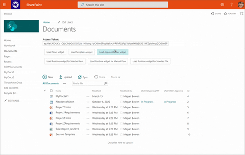

# Summary
Sample showing how to integrate Power Automate into a web app. Users can create new flows from a template, approve, invoke certain type of flows

Here is the sample in action:

Note that depending on the user community interest I will further expand on this blog post by explaining in detail on how to add to SPO site.

# Pre-requisites
- Node
- Register AAD application with Implicit grant enabled.

# Configure and run the sample Applicaton
- Open index.html under FlowWidgetSPA
- Modify 'clientID' property in applicaionConfig object to point to AAD application registered.
- Sample app is configured to user Flow scopes Flows.Read.All and Flow.Manage.All additional scopes can be added by updating flowScopes property in applicationConfig object.
- Open command prompt and go to folder FlowWidgetSampleApp
- Run "npm install" to install the dependencies.
- Run "node server.js" to start the application.
- Open browser and type http://localhost:30662
- Select "Sign In" button to authenticate to AAD and acquire flow access token.
- You will notice that access token text box is populated with the access token.
- Select Load Flows widget or Load Templates widget to embed the widget.
- You can experiment with various widget settings by modifying the javascript methods loadFlowsWidget() and loadTemplatesWidget().

Hope that helps!