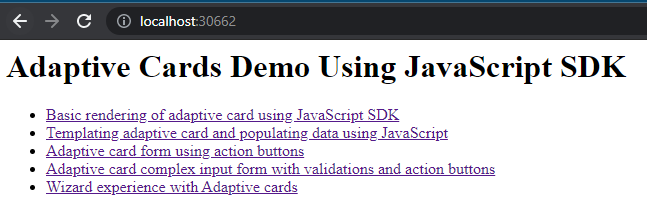

# Summary
This post introduce you to a sample that demonstrates using JavaScript SDK to render Adaptive Cards and different other capabilities.

# Scenarios Covered
- Basic rendering of adaptive card using JavaScript SDK
- Templating adaptive card and populating data using JavaScript
- Adaptive card form using action buttons
- Adaptive card complex input form with validations and action buttons
- Wizard experience with Adaptive cards

# Get Started
You can fork or clone the sample from [GitHub](https://github.com/svarukala/AdaptiveCards-UsingJavaScript)- 
- Clone the source code
- Navigate to the folder
- Run npm install
- Run node .\server.js
- Navigate to http://localhost:30662/

Hope that helps!