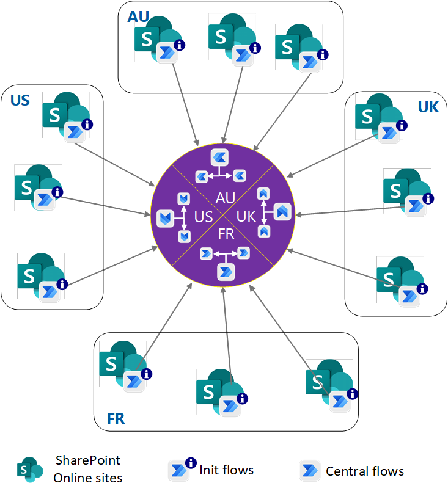

# Summary
Microsoft Power Automate is part of the no-code or low-code Microsoft Power Platform- Microsoft 365 customers use Power Automate for workflow automation and business process flows- This architecture is for Power Automate workflows that replace SharePoint 2010 workflows, and for new SharePoint Online sites- There is some backstory to thsi post- I presented an internal session at Microsoft which got Product Groups attention- Upon request from PG Architecture group I authored an official article on [MS Docs](https://docs.microsoft.com/en-us/azure/architecture/example-scenario/power-automate/power-automate)- This blog post is a summary and link to that article- This way I want to keep track of my contributions at once place i.e- in this blog site.

# Introduction
With this solution, you can:
- Carefully plan your Power Automate deployment, governance, and operation strategy.
- Meet organizational needs like data residency requirements, data loss prevention (DLP), and flexible and minimal licensing requirements.
- Stay within the scalable thresholds of Power Platform.

# Architecture

Hope that helps!