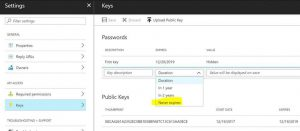

  

PowerShell to list all Azure AD Apps with expiration dates
==========================================================

[Srinivas Varukala](https://social.msdn.microsoft.com/profile/Srinivas Varukala) 1/26/2018 6:33:14 PM

* * *

This article is about how to get all Azure AD Applications using PowerShell. Especially the focus is on identifying the Azure AD Apps that are expiring.  To begin with, Azure AD Apps keys are of two types:

1.  Passwords
    1.  These are auto-generated on demand. While doing this we can select either 1 year or 2 years or Never expires (as shown in screenshot below).
2.  Public Keys
    1.  These are the manual keys created using certificates. The screenshot shows the thumbprints for the certificate that was used as a key.

 Below is PS script that can be used to list out all the Azure AD apps along with the Keys (both types) and the expiry dates.  This is the sample output from this script. Note that some of the apps can have multiple entries or zero entries as an app can have multiple keys or no keys at all. 