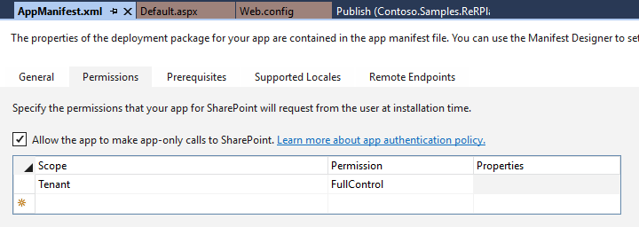
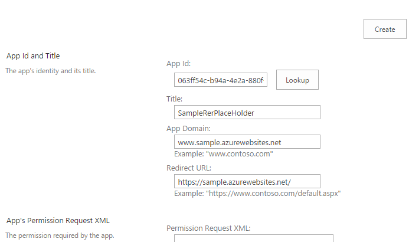

  

Deploy Remote Event Receiver without using add-in or app (without using AppInstalled event to be precise)
=========================================================================================================

[Srinivas Varukala](https://social.msdn.microsoft.com/profile/Srinivas Varukala) 2/7/2016 9:38:00 PM

* * *

UPDATED (3/31/2017): Added links to GitHub projects/source code. See at the end of this article. You still need to create a dummy app(cliend id/secret creating an app principal) or install a provider hosted add-in/app that acts as a placeholder (dummy). More details below. Below article is based on my work on SPonline (not on-premises). How does remote event receivers work? The logic is simple as you know, we just need to tell SharePoint that go and talk to a WCF URL on a certain event (e.g. ListAdded or ItemAdding etc.) We host this WCF site in Azure and the URL is something like [https://rer.azurewebsites.net](https://rer.azurewebsites.net). When the event occurs, SharePoint attempts to reach out to this URL while sending the event properties object (SPRemoteEventProperties). Let me break it down from here. You can start by creating a regular WCF service based web app that implements the IRemoteEventService interface. This essentially means it must override the methods ProcessEvent and ProcessOneWayEvent methods. Add references to SharePoint Client 16 Dlls using Nuget manager. You can optionally add Office Dev Pnp reference too using nuget again. Ensure Microsoft.IdentityModel package is also added (which most probably will be added automatically due to dependencies). Make sure that your project now has the TokenHelper.cs class also. The clientcontext object is retrieved as a app only access token. This code is different from the code that is used normally for a RER. Do not publish the site to Azure yet. Note: Instead of creating another web app like above, you can also use the remote web project that gets created when you create the Provider hosted app. Create a new Provider Hosted App in visual studio. I created one and named it as Contoso.Samples.ReRPlaceHolderApp. As the name suggests this acts as a placeholder app only and we deploy it just once and do not redeploy when our code change. Now open up the AppManfiest.xml and ensure that "allow the app to make app-only calls to sharepoint" is checked. Also, I gave full tenant permissions so that we can attach the RER to any Web or List across the tenant.  I then generated a new client id and secret using the appregnew.aspx page. For the app domain and  redirect url you can use any test url. Below are my app details.     Used the above client id/secret values while deploying the PHA app to the tenant. Upload the. app file and then trust it. Note that I never bothered about the remote web that gets created in visual studio. I never deployed it. As noted above you can still use this remote web for the azure site. We need to do the above so that we have an app principal (app id and secret) that is trusted in our tenant. We later use the app id and secret in our WCF project. **Recommended for Dev Environments**:

> Instead of creating a dummy Provider Hosted App just to get the app principal, you can easily create an app principal by following below steps: Navigate to \_layouts/appregnew.aspx for any of the SPO sites, create new client id/secret. Then go to \_layouts/appinv.aspx, search for that client id, then add the permission XML:

```xml
> <AppPermissionRequests AllowAppOnlyPolicy="true">
> 
> <AppPermissionRequest
> 
> Scope="[http://sharepoint/content/tenant"](https://na01.safelinks.protection.outlook.com/?url=https%3a%2f%2furldefense.proofpoint.com%2fv2%2furl%3fu%3dhttp-3A__sharepoint_content_tenant-26quot-3B%26d%3dDQQFAg%26c%3d_hRq4mqlUmqpqlyQ5hkoDXIVh6I6pxfkkNxQuL0p-Z0%26r%3dwovW-s9gZEEVP8sVwTHB7lc4431NchRx13HryR_jFEHLF2eS33xLDj-mUxr9sRg3%26m%3dcnLAbTY2aLxuz6FBugA8R-VSYNlwsupRHpvwWF_Iags%26s%3dGShvXFjtw-UHdfnQYbEmqm4TJGPpjCX9GIuWR4IR8Vw%26e%3d&data=01%7c01%7csvarukal%40microsoft.com%7cf5b7aeb006344e32531d08d37d5aa203%7c72f988bf86f141af91ab2d7cd011db47%7c1&sdata=tUgU0B1W5U3m3pPDuysk41psut23QQFZj6mj2diyGSY%3d)
> 
> Right="FullControl"/>
> 
> </AppPermissionRequests>
```
 
> Then in the next page, **Trust the app**. That's it, you've created an app principal. If your prod deployment team is okay, you can follow same steps in prod too but not recommended. Otherwise, you have to deploy the app in app catalog.

Let's go back to our WCF project and plug in the App id and secret in the web.config file. 

```xml
<appSettings> <add key="ClientId" value="063ff54c-b94a-4e2a-880f-061cc899a239" /> <add key="ClientSecret" value="UsLDcUpWxoVuN8eKME7PhOqMTcRO+JSQb8TWkU0S7qA=" /> </appSettings>
```

 Now go ahead and deploy the web app to Azure. You can use a C# console or PowerShell to configure the above Azure URL as RER, say for example, on a ListAdded event call this URL. Here is sample code: EventReceiverDefinitionCreationInformation eventReceiver = new EventReceiverDefinitionCreationInformation (); eventReceiver.EventType = eventReceiverType; eventReceiver.ReceiverClass = "Contoso.Samples.RERWeb.Services.SampleRERService"; eventReceiver.ReceiverName = "SampleRERListAdded"; eventReceiver.ReceiverUrl = "[https://samplerer.azurewebsites.net/Services/SampleRERService.svc](https://samplererweb.azurewebsites.net/Services/SampleRERService.svc)"; eventReceiver.Synchronization = EventReceiverSynchronization.Synchronous; web.EventReceivers.Add(eventReceiver); clientContext.ExecuteQuery(); Major benefits with this approach:

1.  Development is lesser hassle. I have seen dev teams installing, uninstalling and redeploying every time they want to try different events (ListAdded/Adding sync/async).
2.  You can keep updating your WCF service project and deploy to Azure and then use PowerShell/C# to add/remove receivers to different sites and for different events.
3.  One place holder PHA is enough to deploy multiple RERs
4.  In traditional approach, the app appears in the site contents page. This method gets around it.

I have code samples that I plan to link here or upload to GitHub. Code samples are published on GitHub. RERDeployer: https://github.com/svarukala/RemoteEventReceiverDeployerTool RERSampleWeb: https://github.com/svarukala/RemoteEventReceiverWeb