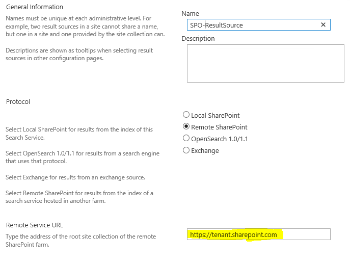

  

One way outbound search results working only for global admin users
===================================================================

[Srinivas Varukala](https://social.msdn.microsoft.com/profile/Srinivas Varukala) 5/9/2015 11:06:00 AM

* * *

In an outbound hybrid search configuration you use the on-premises SharePoint search center to show the results both from SharePoint online and on-premises. By now I expect most of you to know about this [blog](http://blogs.msdn.com/b/spses/archive/2013/10/22/office-365-configure-hybrid-search-with-directory-synchronization.aspx) that has the step by step guidance on this topic. One of the final steps in this process is to create a result source and a query rule that executes against the former result source. While creating the result source as you can see in the below image you need to provide the 'Remote Service URL'. You need to ensure this URL is the root site collection URL of your tenancy. For example: [https://contoso.sharepoint.com](https://contoso.sharepoint.com).

  

If by mistake you enter your tenant admin url i.e. [https://contoso-admin.sharepoint.com](https://contososv-admin.sharepoint.com) here, then you will see below behavior and errors.

The on-premises SharePoint center will show hybrid results from SPO only if you are logged in as one of the tenant Global Admins. It doesn't return any results while logged in as any other user.

While logged in as a regular user (like site owner or member), go to Site collection settings page and open the query rules, edit the remote search results query rule. Open the query builder and run a test query for say '\*'. You will see below error in the query builder:

Using UPN ['userid@domain.com'](mailto:'userid@domain.com') for SMTP claim            

RemoteSharepointProducerSystem.Net.WebException: The remote server returned an error: (500) Internal Server Error.    at System.Net.HttpWebRequest.GetResponse()     at  
Microsoft.SharePoint.Client.SPWebRequestExecutor.Execute()      
at Microsoft.SharePoint.Client.ClientContext.GetFormDigestInfoPrivate()      
at Microsoft.SharePoint.Client.ClientContext.EnsureFormDigest()      
at Microsoft.SharePoint.Client.ClientContext.ExecuteQuery()      
at Microsoft.Office.Server.Search.RemoteSharepoint.RemoteSharepointEvaluator.RemoteSharepointProducer.RetrieveDataFromRemoteServer(Object unused)     at System.Threading.ExecutionContext.RunInternal(ExecutionContext executionContext, ContextCallback callback, Object state, BooleanpreserveSyncCtx)     at System.Threading.ExecutionContext.Run(ExecutionContext... 

Ensuring all of your users have read access to the root site collection is also important so that hybrid search results work without any issues.