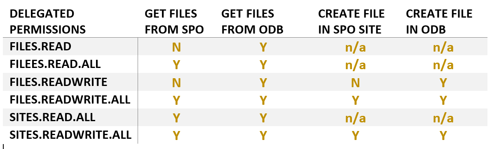

Understanding Microsoft Graph Delegated Permissions for OneDrive versus SharePoint Online Sites 
===============================================================================================

One of my peers raised a question recently in one of our internal Teams.
The question was something like this:

"*Using Microsoft Graph can we have read/write permissions that applies only to OneDrive for Business and not to SPO sites?*"

I thought I know the answer but after pondering for a minute I got
confused. My confusion was around

- What is the difference between Files.Read.\* and Sites.Read.\*?

- What is the difference between Files.Read/Files.ReadWrite and Files.Read.All/Files.ReadWrite.All?

I read MS Docs
[article](https://docs.microsoft.com/en-us/onedrive/developer/rest-api/concepts/permissions_reference?view=odsp-graph-online)
that helps clarify things to some extent. Then I decided to figure this
out using some scripts and running sample queries (more info below)
against Microsoft Graph. Here are the results:

-   In short, the answer to my peers' question is Yes, its possible.
    Using FILES.READ and FILES.READWRITE permission scopes, you can
    restrict it to OneDrive for Business site only.

-   As soon as you append ALL to these permission scopes, you can start
    querying SPO sites too.

-   SITES.READ.ALL and SITES.READWRITE.ALL scopes give permission to
    access both ODB and SPO Sites.

Here is nice table representation of the same:


That's all delegated permissions. How about Application (App-Only)
Permissions? There is no App-Only permission scope defined for ODB
access. The Application Permission scopes apply only to SPO sites. Here
are the available ones:

-   Files.Read.All

-   Files.ReadWrite.All

-   Sites.Read.All

-   Sites.ReadWrite.All

The difference between Files.\*and Sites.\* permission scope:

-   Files.\* scope allows to access all files in all site collections
    without a signed in user.

-   Sites.\* scope allows to access all files and read all list items in
    all site collections without a signed in user.

If you are interested in PS script sample that I used for this exercise,
please continue to read. I started with PS script that I picked from
[here](https://www.thelazyadministrator.com/2019/07/22/connect-and-navigate-the-microsoft-graph-api-with-powershell/).
Thanks to Brad Wyatt and his samples that covers various authN scenarios
(AuthCode, DeviceCode, AppOnly, Password Creds etc.).

Get files from SPO library:
```PS1
#The GUID is the Library/List ID.
$apiUrl = 'https://graph.microsoft.com/v1.0/sites/root/lists/45c12593-c895-478c-916c-15c6368a40dc/items'
try {
    $spoResult = Invoke-RestMethod -Headers @{Authorization = "Bearer $($Tokenresponse.access_token)"} -Uri $apiUrl -Method Get
    Write-output "Received SPO lib items"
    Write-output $spoResult.value.count
}
catch {
    Write-Output "Failed to get files from SPO"    
    Write-Host "StatusCode:" $_.Exception.Response.StatusCode.value__
    Write-Host "StatusDescription:"
    $_.Exception.Response.StatusDescription
}
```

Get files from ODB:
```PS1
$apiUrl = 'https://graph.microsoft.com/v1.0/me/drive/root/children'
try {
    $odbResult = Invoke-RestMethod -Headers @{Authorization = "Bearer $($Tokenresponse.access_token)"} -Uri $apiUrl -Method Get
    Write-output "Received ODB items"
    Write-output $odbResult.value.count
}
catch {    
    Write-Output "Failed to get files from ODB"
    Write-Host "StatusCode:" $_.Exception.Response.StatusCode.value__
    Write-Host "StatusDescription:"
    $_.Exception.Response.StatusDescription
}
```

Create file in ODB:
```PS1
$apiUrl = 'https://graph.microsoft.com/v1.0/me/drive/root:/DemoFile.txt:/content'
$body = " This is sample text that goes into the text file"
try {
    $odbData = Invoke-RestMethod -Headers @{Authorization = "Bearer $($Tokenresponse.access_token)"} -Uri $apiUrl -Method Put -Body $body -ContentType "text/plain" -ResponseHeadersVariable odbRespHeaders
    Write-output "Created ODB file"
    Write-output $odbData.webUrl
    #Write-Output $odbRespHeaders
}
catch {
    Write-Output "Failed to create file in ODB"
    Write-Host "StatusCode:" $_.Exception.Response.StatusCode.value__
    Write-Host "StatusDescription:"
    $_.Exception.Response.StatusDescription
}
```

Create file in SPO:
```PS1
$apiUrl = 'https://graph.microsoft.com/v1.0/sites/root/drive/items/root:/DemoFile.txt:/content'
$body = "This is sample text that goes into the text file"
try {
    $spoData = Invoke-RestMethod -Headers @{Authorization = "Bearer $($Tokenresponse.access_token)"} -Uri $apiUrl -Method Put -Body $body -ContentType "text/plain" -ResponseHeadersVariable spoRespHeaders
    Write-output "Created SPO file"
    Write-output $spoData.webUrl
}
catch {
    Write-Output "Failed to create file in SPO"
    Write-Host "StatusCode:" $_.Exception.Response.StatusCode.value__
    Write-Host "StatusDescription:" $_.Exception.Response.StatusDescription
}
```

Below is the full script:
[gist](https://gist.github.com/svarukala/81534c815d6affbd47d472bf24ebf9d7#file-connect-msgraphauthcodeodbvsspoperms-ps1)

`gist:svarukala/81534c815d6affbd47d472bf24ebf9d7#Connect-MSGraphAuthCodeODBvsSPOPerms.ps1`