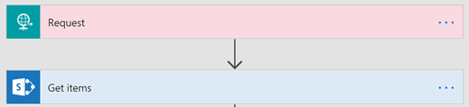
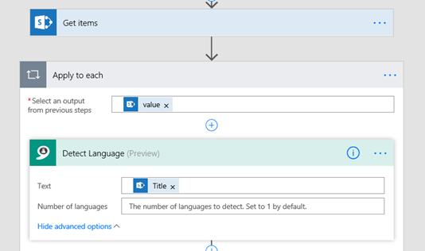
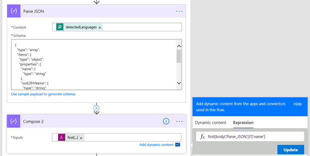
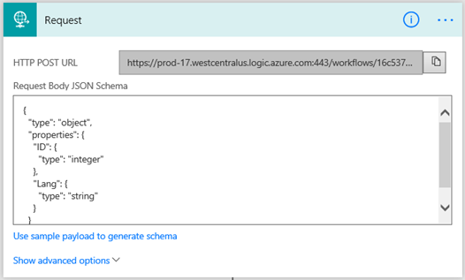
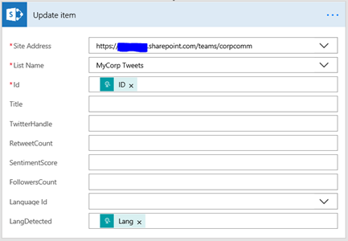
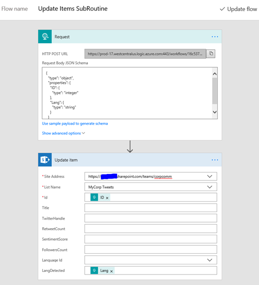
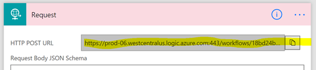
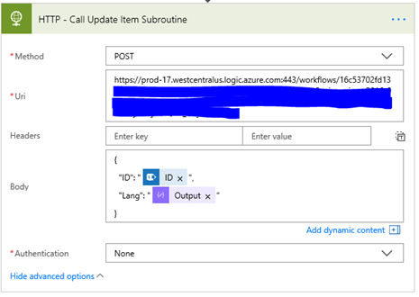
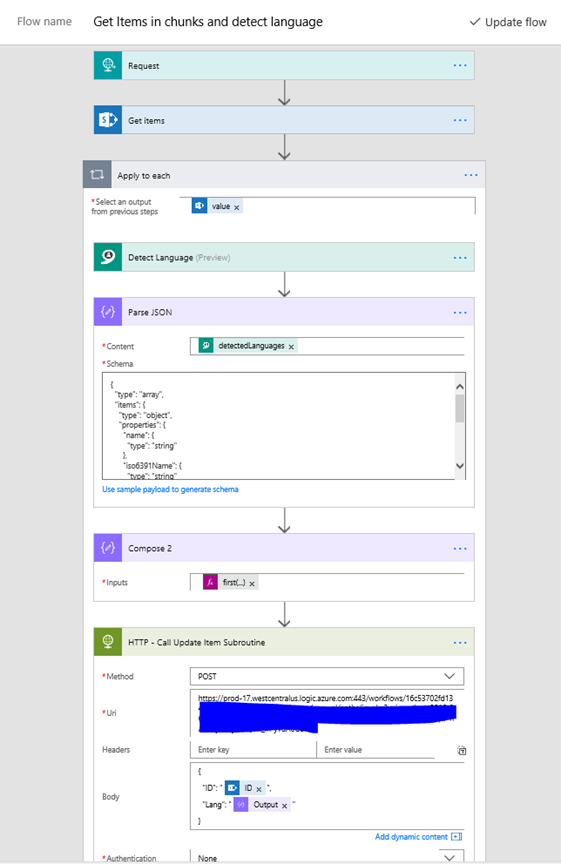
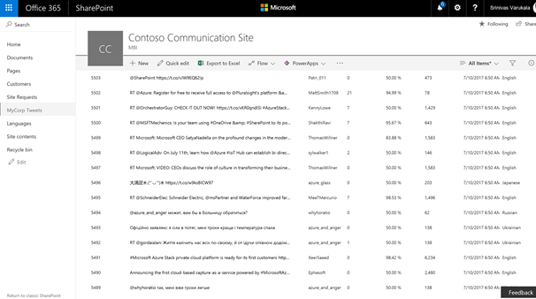

  

Update all items in a large list/library using Microsoft Flow (no-code solution)
================================================================================

[Srinivas Varukala](https://social.msdn.microsoft.com/profile/Srinivas Varukala) 8/17/2017 9:49:27 PM

* * *

This is the part 3 of the [3 part series](https://blogs.msdn.microsoft.com/svarukala/2017/08/04/using-microsoft-flow-with-large-lists-3-part-series/) related to handling large lists with Microsoft Flow – a no-code solution.

This post will demonstrate how you can iterate through a large list (or library) circumventing the list view threshold restrictions and update the items.

**Solution is simple**: Get list items in chunks (of say 512 items) and iterate over each item and call into a child Flow (nested flow concept, remember?). This child flow will take care of updating the list item. The Flow that we will create will introduce you to following concepts:

1.  Nested flows
2.  Using Microsoft Cognitive API – Language detection
3.  Parsing JSON
4.  Data operations/manipulations

**Which column are we going to update?**

If you remember from my blog post part 1, we created a large list from tweets from Twitter. I have screenshot below, you can see that there is a column called **LangDetected** which is empty. We are going to pass the Tweet text (Title column) to a Cognitive API to detect the language and then update this column with the detected language.

**Detailed Steps:**

1.  We will begin with the child flow that we created (steps 7.1 to 7.4) in [Part 2](https://blogs.msdn.microsoft.com/svarukala/2017/08/08/iterate-and-get-all-items-from-a-sharepoint-large-list-or-library-using-microsoft-flow-no-code-solution/) of this [blog series](https://blogs.msdn.microsoft.com/svarukala/2017/08/04/using-microsoft-flow-with-large-lists-3-part-series/). For your reference here is the screenshot of this child flow in its current state:
    
    
    
2.  Add Apply to each step next and pass the output from Get items step to it as input.
3.  Action: Search for Detect Language, Select 'Text Analytics – Detect Language'. I configured the Cognitive API Text Analytics already in Part 1. Configure it by selecting the Title column as its input.
    
    
    
4.  Action: Search for "Parse JSON", Select Data operation – Parse JSON. Pass the output from Detect Language step to this step. In the schema, past the following:
    
    **_{_**
    
    **_"type": "array",_**
    
    **_"items": {_**
    
    **_"type": "object",_**
    
    **_"properties": {_**
    
    **_"name": {_**
    
    **_"type": "string"_**
    
    **_},_**
    
    **_"iso6391Name": {_**
    
    **_"type": "string"_**
    
    **_},_**
    
    **_"score": {_**
    
    **_"type": "number"_**
    
    **_}_**
    
    **_},_**
    
    **_"required": \[_**
    
    **_"name",_**
    
    **_"iso6391Name",_**
    
    **_"score"_**
    
    **_\]_**
    
    **_}_**
    
    **_}_**
    
    Tip: To create schema, you can pick sample output from DetectLanguage step and use it in jsonschema.net website to generate the schema.
    
5.  Action: Search for Compose > Select Data Operations – Compose. We will use expression first(body('Parse\_JSON'))?\['name'\] to get the first language detected from the Parse JSON step.
    
    
    
6.  We will create a separate flow that will be called within this flow. This separate flow will take the language detected and item index as input parameters and update the corresponding list item.
7.  Create a Child Flow by starting from blank Flow template.
    
    1.  Trigger: Search for Request, Select 'Request/Response – Request' trigger. This will create a URL for this flow that we can call into from the parent flow. This is similar to HTTP Triggered Functions in Azure. We want to send the item index and language detected to this flow as JSON data. Configure this trigger to accept ID (item id) and Lang (Detected language) using below JSON schema.
        
        **_{_**
        
        **_"type": "object",_**
        
        **_"properties": {_**
        
        **_"ID": {_**
        
        **_"type": "integer"_**
        
        **_},_**
        
        **_"Lang": {_**
        
        **_"type": "string"_**
        
        **_}_**
        
        **_}_**
        
        **_}_**
        
    
    **_    _**
    
    1.  Action: Search for Update Item > Select SharePoint - Update item action. Configure it by passing the ID and Lang as follows:
        
        
        
    2.  Here is the full screenshot of this child flow
        
        
        
    
    1.  Expand the trigget 'Request' action and copy the HTTP POST URL
        
        
        
    
8.  Continuing editing parent flow from step 6. We got the Language detected in step 6. We need to now call the child flow and pass the item index and language detected as JSON parameter.
    
    1.  Action: Search for HTTP, Select HTTP – HTTP action. Configure as follows
        
        1.  Method: POST
        2.  Uri: Paste the URL copied from stpe 7.d
        3.  Body: as shown in this image
        
        
        
9.  That completes the parent flow. Here is the full screenshot of this flow.
    
    
    
10.  After running these flows (from part 2 and 3) I was able to update the Language column for every tweet for all the 5500+ items. Here is the screenshot of the large list. Notice the LangDetected column (last column)
    
    