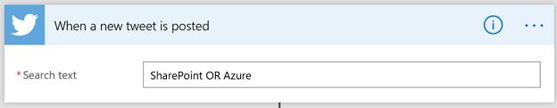
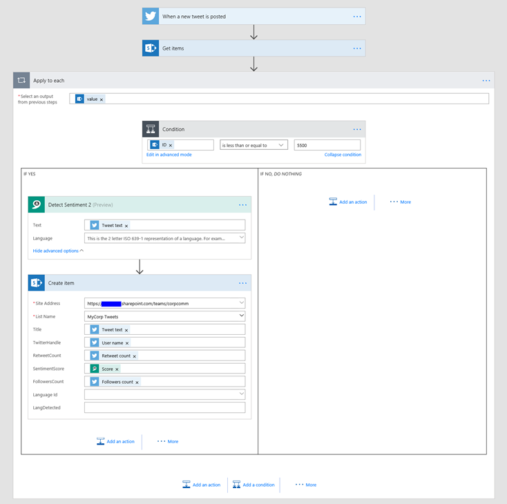

  

Create SharePoint Large Lists using Microsoft Flow (no-code solution)
=====================================================================

[Srinivas Varukala](https://social.msdn.microsoft.com/profile/Srinivas Varukala) 8/4/2017 5:19:57 AM

* * *

This is the part 1 of the [3 part series](https://blogs.msdn.microsoft.com/svarukala/2017/08/04/using-microsoft-flow-with-large-lists-3-part-series/) related to handling large lists with Microsoft Flow – a no-code solution.

This post will demonstrate how you can create large lists with test data.

There could be many reasons to create a large list. In my case, I had to demonstrate how PowerApps can deal with large lists and I needed a large list (with >5000 items). I could create a Microsoft Flow to do exactly that. Now my Flow can be saved as a template and reused by others too. This makes Flow even more powerful.

**Solution is very simple**: Monitor twitter feed and get the tweet data into a SharePoint List.

I added something extra to the mix. I also used Microsoft Cognitive API (specifically [Text Analytics API](https://azure.microsoft.com/en-us/services/cognitive-services/text-analytics/)) to detect the sentiment (positive or negative tweet) of the twitter feed and extract some good metadata out of it which will be saved into List columns.

I also added the logic to insert items only if the total items count is < 5500 items. This effectively stops populating the list forever. This will save your Flow execution cycles and also your Azure spend on the Text analytics api.

Below are screens of the list after populating it with >5000 items.

Screen 1:

Screen 2:

Screen 1: Shows the items sort ascending on the ID column.

Screen 2: Shows the items sort descending on the ID Column. You can see that my list has >5000 items.

Detailed Steps:

1.  Create the SharePoint list (I named it MyCorp Tweets). Add columns:
    
    1.  TwitterHandle (Text)
    2.  RetweetCount (Number)
    3.  FollowersCount (Number)
    4.  SentimentScore (Number, two decimal with %)
    5.  LangDetected (Text)
2.  Begin by selecting the Tigger "when a new tweet is posted". You could start from existing template or from blank.
    
    
    
3.  I configure it to search for certain keywords that's popular: SharePoint OR Azure
    
    
    
4.  Add an action as the next step and select SharePoint – Get Items and configure it to retrieve only a single item with the max ID. I used Order By and Top count parameter to achieve this.
    
    
    
5.  Next Add an Apply to Each action. Pass the output from the SharePoint – Get items to this step as input.
6.  Now Add a Condition action. The condition checks if the ID (gotten from SharePoint – Get items) is <= 5500. Below screen shows it in action:
    
    
    
7.  Let's shift gears and go to Azure Portal to create Cognitive Services – Text Analytics Service. In Azure Portal, clicke +New button, search for "Cognitive Services". Select it and click Create button. Fill up the details as follows to create a new Text Analytics service.
    
    
    
8.  Once the Text Analytics service is created, select it and then select 'Keys' that is under the "Resource Management" within the settings blade. Copy one of the keys to clipboard.
    
    
    
9.  Now, lets get back to Flow designer. If the above condition (step 7) is satisfied (i.e IF YES branch), lets pass the tweet text to the Text Analytics – Detect Sentiment action. To do this, add an action in the IF YES branch and search for "Text Analtyics". Select Text Analytics – Detect Sentiment. Give it a unique connection name and paste the key into the Account key text field.
    
    
    
10.  Next, configure it by passing the Tweet text as its input.
    
    
    
11.  Now add new action SharePoint – Create Item. Configure it as follows:
    
    
    
12.  Note that I am using the 'Score' value which is the output from the Text Analytics – Detect Sentiment step.
13.  Overall, your flow should look something like below.
    
    
    
14.  I have not added any action to the 'IF NO' branch for the IF condition. I will leave that as an exercise for you. You can add an Email action to alert you that the list has enough items.

In the Part 2 of this series I will show you how to Iterate and get all items from a Large List/Library using Microsoft Flow (no-code solution). When I worked on this demo, Flow could get a max 512 items only. So the solution to iterate a large list is quite interesting.