  

Iterate and get all items from a SharePoint Large List or Library using Microsoft Flow (no-code solution)
=========================================================================================================

[Srinivas Varukala](https://social.msdn.microsoft.com/profile/Srinivas Varukala) 8/8/2017 3:33:09 AM

* * *

**Update (8/15/17):** Added more content at the end of this article, related to using the out of the box pagination feature avoiding a lot of steps needed as long as it's less than 5000 items.

This is the part 2 of the [3 part series](https://blogs.msdn.microsoft.com/svarukala/2017/08/04/using-microsoft-flow-with-large-lists-3-part-series/) related to handling large lists with Microsoft Flow – a no-code solution.

This post will demonstrate how you can iterate through a large list (or library) circumventing the list view threshold restrictions.

Once you have the list iterator in Flow, you can use and reuse for man use cases, such as updating a List column data for all the items or copying list items to a different list or identifying items based on a certain criterion, so on so forth.

**Solution is moderately complex**: Get list items in chunks (of say 512 items) and iterate over each item to read the items. The Flow that we will create will introduce you to following concepts:

*   Using Variables
*   Using Workflow definition language (WDL)
*   Using Nested Flows
*   Using Arrays
*   Using Data Operations (like Compose)

**What's the need for this post?** The main reason I even thought about blogging this was because the 'SharePoint – Get Items' action used to support only 512 items i.e. it could fetch only 512 items at a time. But things have changed since then, it now supports large items (>1000) too. I tested with a large list to fetch 5000+ items and sure enough it failed with below error:

{ "status": 502, "message": "The attempted operation is prohibited because it exceeds the list view threshold enforced by the administrator.\\r\\nclientRequestId: bac7333a-f73b-4338-a431-ca88c70fd8a0", "source": "https://mytenant.sharepoint.com/teams/corpcomm//\_api/SP.APIHubConnector.GetListItems(listName='c23b10c5-c190-45f2-bc9b-aabe72f87d08',queryOptions=@q)?@q='%2524top%3d5100'", "errors": \[ "-2147024860", "Microsoft.SharePoint.SPQueryThrottledException" \] }

This means, this blog post is still relevant, because the only way to get around this is to get the large list items in smaller chunks.

**Detailed Implementation Steps:**

1.  Trigger: We can either use a Schedule or a HTTP trigger as the first step. I chose Schedule and configured it to once per day.
2.  Action: Search for 'Variable' > select 'Variable – Initialize Variable' step. Configure it as follows. This variable will be used to identify how many times we need to iterate to get all the list items in chunks of say 512 items.
    
    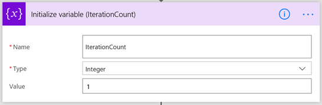
    
3.  Action: 'SharePoint – Get Items'. Get the total item count using the ID desc , top count 1 settings.
    
    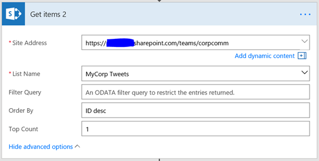
    
4.  Add 'Apply for each' and pass output from step 3 as input.
    
    1.  Action: Within Apply for each > Search for 'Compose' > Select 'Data Operations – Compose'. Compose is a powerful action; it can be used to evaluate [expressions](https://flow.microsoft.com/en-us/blog/use-expressions-in-actions/) (Excel type formulas from [Workflow Definition language](https://docs.microsoft.com/en-us/azure/logic-apps/logic-apps-workflow-definition-language)), create variables etc. We will use compose to calculate the number of times we require to iterate in chunks of say 512 items to process all the items. We simply divide (using Div() expression) the total item count by 512. By default, the Div() expression always returns the floor value for the result. For example, Div(925, 512) will give you 1 (floor value), not 2 (ceiling value). This is important to note and has a downside that's fixed in step 4.c. Here is the expression that you need put in the compose: "@div(item()?\['ID'\],512)" if you are going to type it. Flow designer now supports Expression in the pop up shown in the below image.
    
    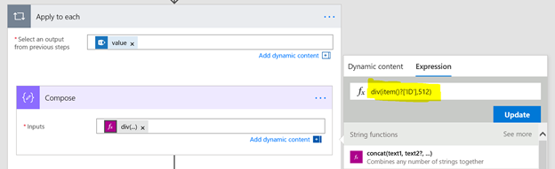
    
    1.  Add a Condition after 'Compose' action. The condition checks if the output from step 5 is greater than 1.
    2.  IF YES,
        
        1.  Add another 'Compose' action with this formula: add(outputs('Compose'),1). This basically increments the value that we got in step 4.a by one. This ensures that we cover a scenario where there is are residual items that's not covered by the iterations because step 4.a gives floor value but not ceiling value. E.g lets say total items count = 925. Step 4.a gives results as 1. But if we iterate just once, we get back the first 512 items only. To get around this we iterate one more time to get the residual items.
        2.  Add action > search for variable > select Set Variable action. Set the IterationCount variable to the output from the above step.
    3.  IF NO, do nothing
    
    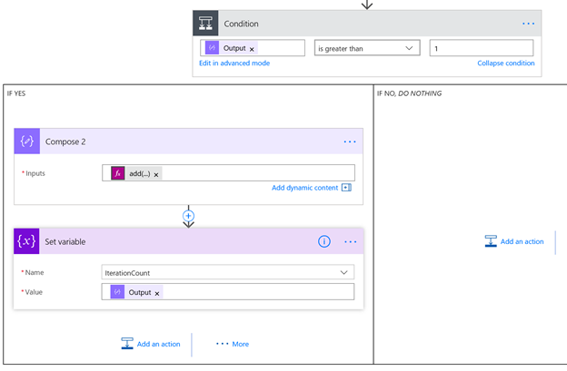
    
5.  Action: Add 'Data Operations – Compose'. We use the expression range() to create an array. The expression to be used is: "@range(1,variables('IterationCount'))". We will use this array as input to a for-each loop and iterate that many times. The array is like this: (1,2,3,4,5) if iterationcount = 5.
    
    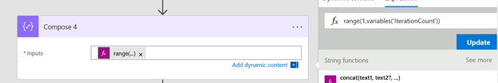
    
6.  Add Apply to each step (for-each loop). Pass the output (array) from step 5 as its input. This will loop n times where n is the iteration count that we calculated already.
    
    1.  Action: Add 'Data Operations – Compose'. This will apply an expression to identify the starting index (ID) of the items to fetch the next 512 items. So, for 1st iteration this value should begin with 0, 2nd iteration it should be 512, 3rd iteration should be 1024 so on. I used the expression: "@mul(sub(item(),1),512)". This uses subtract and multiply functions. Here item() signifies the current loop index (from the array) that we supplied as input to the for-each step. For 1st iteration, mul(sub(1,1), 512) returns 0.
    
    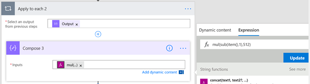
    
    1.  Now introducing the concept of [Nested Flows](https://flow.microsoft.com/en-us/blog/build-nested-flows/). We will create a separate flow that will be called within this flow. This separate flow will take the item index as parameter and fetch the next 512 items starting from that index. This is very similar to writing code, that has methods/functions/subroutines. This child flow will be a method that parent flow will call into. Now let's create the child flow.
        
7.  Create Child Flow by starting from blank Flow template.
    
    1.  Trigger: Search for Request, Select 'Request/Response – Request' trigger. This will create a URL for this flow that we can call into from the parent flow. This is similar to HTTP Triggered Functions in Azure. We want to send the item index to this flow as JSON data. I added the JSON schema for an ItemIndex variable of type integer. See below:
        
        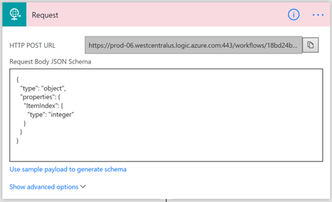
        
        **_{_**
        
        **_"type": "object",_**
        
        **_"properties": {_**
        
        **_"ItemIndex": {_**
        
        **_"type": "integer"_**
        
        **_}_**
        
        **_}_**
        
        **_}_**
        
    2.  Action: Add SharePoint – Get Items action. Now configure to fetch the next 512 items starting with the index number that's passed as a JSON parameter to this flow. As shown below, we use the Filter Query to filter by ID greater than or equal to ItemIndex.
        
        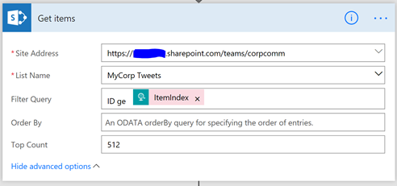
        
    3.  Here is the full screenshot of this flow:
        
        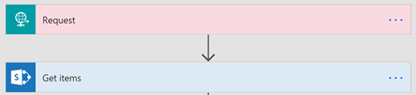
        
    4.  Expand the 'Request' action and copy the HTTP POST URL
        
        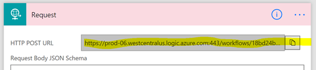
        
8.  Continuing editing parent flow from step 6. We got the itemindex figured out in step 6. We need to now call the child flow and pass the itemindex as JSON parameter.
    
    1.  Action: Search for HTTP, Select HTTP – HTTP action. Configure as follows
        
        1.  Method: POST
        2.  Uri: Paste the URL copied from stpe 7.d
        3.  Body:
            
            **_{_**
            
            **_"ItemIndex": "@{outputs('Compose\_3')}"_**
            
            **_}_**
            
        
        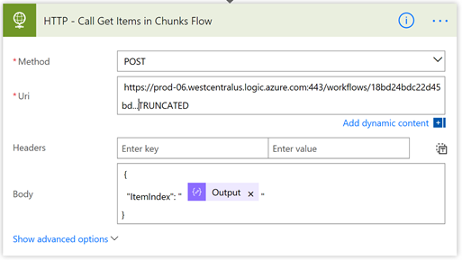
        
    2.  The for-each loop created in Step 6, will not call the child flow n number of times, where n is the iterationcount that we calculated.
    3.  That's the end of the parent flow. Here is the full screenshot with minimized actions/steps
        
        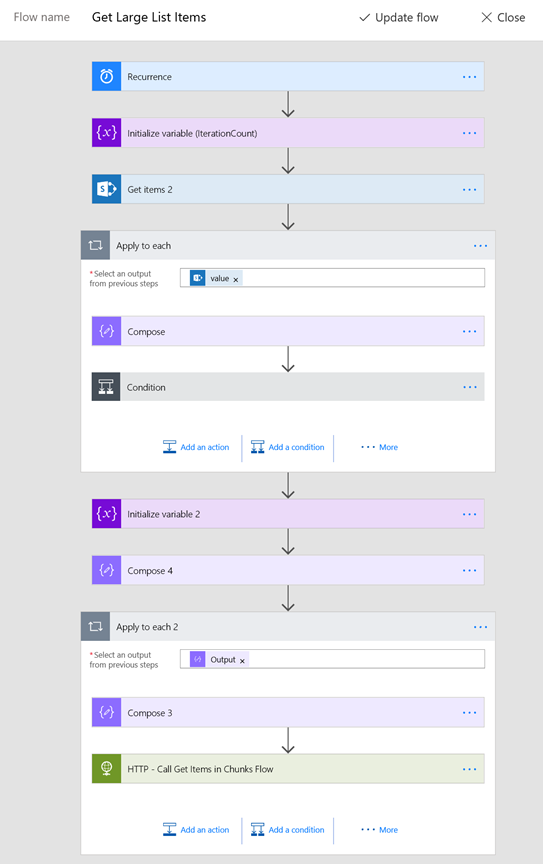
        

In Part 3, I will show you how to update the list items from within the child flow, creating grandchild flow and also show you how to use Cognitive API to detect tweet text language.

UPDATE (8/15/17)

Just a week before I published this article there was an [announcement](https://flow.microsoft.com/en-us/blog/four-connector-action-settings/) that allows "pagination" using the Flow actions like SharePoint – Get Items. Essentially that solves the problem that I went through documenting in this article. I set out to test this new feature and created a Flow to get more than 5000 items from my list using pagination. I found some limitations which makes this blog post still a valid one. Yay! More details below.

1.  Started from a blank flow. Added Schedule as my trigger. Configured it to run once per day. This doesn't matter. This the quickest way to create a flow with least amount of work/settings.
2.  Action: Added SharePoint – Get Items. Provided my SPO site url, large list and set Top Count to 10. See screen below.
    
    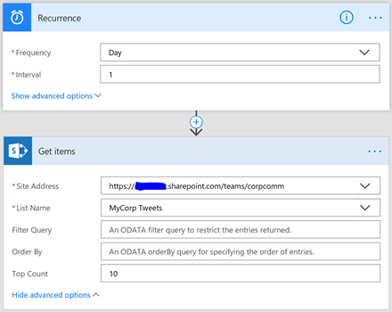
    
3.  Now, click on the ellipses i.e the three dots (…) in the top right corner for the Get items action and select settings.
    
    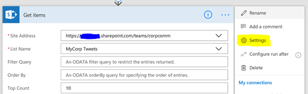
    
4.  In the screen opened you will see a way to turn on pagination and set max items to fetch.
    
    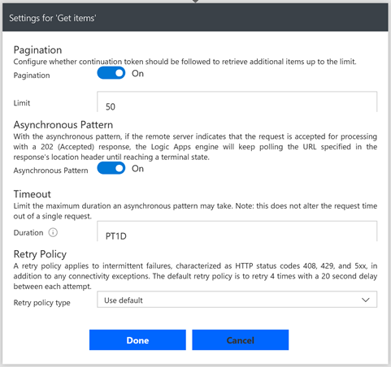
    
5.  I turned on the Pagination, set the Limit to 50. So, the Get Items action will fetch 10 items (since we set Top count to 10) each up to 50. Essentially it iterated 5 times getting 10 items each.
6.  I ran the flow and voila within a few seconds, it's done and it got back 50 items as expected.
7.  Now, I changed the max Limit from 50 to 5100, to test the limits. Also, changed the top count to 1000, so that it paginates 5 times fetching 1000 items each. Saved/updated the flow. That's when I got this error message in the top:
    
    _The pagination policy of workflow run action 'Get\_items' of type 'ApiConnection' at line '1' and column '751' is not valid. The value specified for property 'minimumItemsCount' exceeds the maximum allowed. Actual: '5100'. Maximum: '5000'._
    
    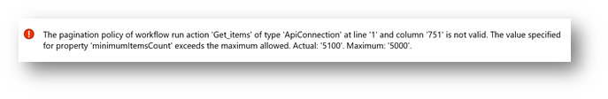
    
8.  That's it, it still has the 5000 items limit. Pagination is a great feature, but we still have to go through a manual steps using flow to iterate more than 5000 items as shown in this blog post.