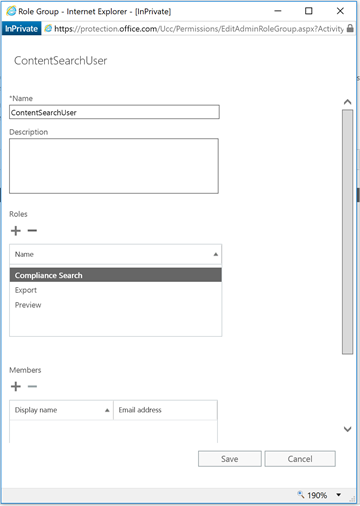
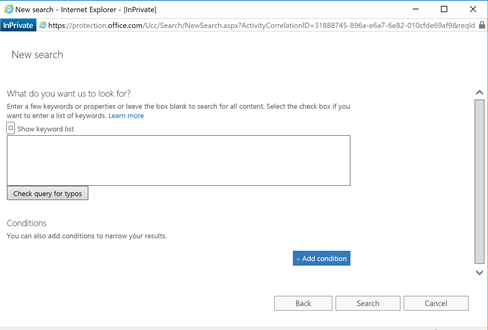

  

How to download or view SharePoint Online Search Crawl Logs using Security & Compliance Center
==============================================================================================

[Srinivas Varukala](https://social.msdn.microsoft.com/profile/Srinivas Varukala) 8/9/2017 9:00:37 PM

* * *

About 2 years back I wrote this article on '[How to View SharePoint Online Crawl Logs in Office 365](https://blogs.technet.microsoft.com/mspfe/2015/11/17/how-to-view-sharepoint-online-crawl-logs-in-office-365/)'. Things change quickly in Office 365 for good reasons. If you don't know it already, you will no longer be able to create new eDiscovery cases in SharePoint Online which essentially makes my article obsolete. Regarding the deprecation of eDiscovery center cases, if you visit this site: [Set up an eDiscovery Center in SharePoint Online](https://support.office.com/en-us/article/Set-up-an-eDiscovery-Center-in-SharePoint-Online-A18F8975-AA7F-43B4-A7D6-001D14744D8E), you will be greeted with this message in the top of the page:  In this post, I will explain two ways to download the crawl logs in SharePoint Online:

1.  Using the Content Search in Security & Compliance center
2.  Using the eDiscovery feature again in Security & Compliance center

**Using Content Search**

1.  If you want to use Global Admin account or Security & Compliance admin account then you can start with step 3. If you want to assign someone permissions to allow them to run this then follow step 2.
2.  Office 365 Global Admin must create or assign the right permissions for a user to be able to export crawl logs.
    
    1.  The minimal permissions I could figure out after playing with permissions is as follows:
        
        1.  Export
        2.  Preview
        3.  Compliance Search
    2.  Logged in as Global admin or Security & Compliance center admin, Navigate to Security & Compliance center > Permissions page.
    3.  Click the **+** button. In the pop up window, give it an appropriate name (I named mine as 'ContentSearchUser').
    4.  Within the popup window, click the **\+** button under Roles. This opens another popup window.
    5.  In this window, select the 3 roles: Export, Preview and Compliance Search. Click the '**Add**' button and then the '**Save**' button.
        
        
    6.  Click the **\+** button under Members. Search for the user(s) or security group, select it, click **Add** button, then **Save** button.
        
        
    7.  These members added in above step can access the Security & Compliance center by navigating to this URL: [https://protection.office.com](https://protection.office.com) and follow from step 3 onwards.
3.  Navigate to **Security & Compliance center** > **Search & Investigation** > **Content Search** page
4.  Click the **+** button to create a new Content Search request.
    
    1.  Give it an appropriate name and add the SharePoint Online Site URL using the **+** button in the bottom section. In my case I added one SP site URL. You can add one or more.
        
        
    2.  Click Next button to see next screen.
        
        
    3.  Click '**Search**' button.
5.  After some wait you will see the options to **Preview search results**, **Update search results** and '**Start export'** link. Click that link.
    
    
6.  Start export link opens a pop window. Select 2nd or 3rd radio button and click '**Start Export'** button.
    
    
7.  Once export is finished, you will see the '**Download exported results'** link activated.
    
    
8.  Click '**Download exported results'** link.
    
    1.  If this is the first time this functionality being used on your computer, you will see prompt like the one below to download '**Microsoft Office 365 eDiscovery Export Tool'**.
    
    
    
    1.  One this is installed, if it doesn't prompt you automatically, click the download result link again. The prompt will let you download results and copy an export key. Shown below.

1.  When you click on the '**Download results'** link, you will see another prompt to enter the Export key and a folder on your PC to save the files:
    
    
2.  In the downloaded results, you will see a bunch of files. Look for this file: Unindexed Items.csv. This file contains the list of items that failed to index.
3.  Below is sample data that I identified in my test site:

  

**Item Identity**

**Original Path**

**Type**

**Size (KB)**

**Error Code**

**Error Type or Addtional Error Info**

**Error Message**

**SharePoint\\Unindexed Items\\Developer Site\\Dev\\Shared Documents\\OWA\\RetailPortal.docx**

[https://mod362200.sharepoint.com/sites/Dev/Shared](https://mod362200.sharepoint.com/sites/Dev/Shared) Documents/OWA/RetailPortal.docx

Unknown

116.082

1

Warning

This item was partially parsed. ( Document was partially processed. The parser was not able to parse the entire document.; ; SearchID = 67E4FC59-5BDC-4993-B798-EBAA52D9EC52 )

**SharePoint\\Unindexed Items\\Developer Site\\Dev\\Shared Documents\\OWA\\hjh\\RetailPortal.docx**

[https://mod362200.sharepoint.com/sites/Dev/Shared](https://mod362200.sharepoint.com/sites/Dev/Shared) Documents/OWA/hjh/RetailPortal.docx

Unknown

116.081

1

Warning

This item was partially parsed. ( Document was partially processed. The parser was not able to parse the entire document.; ; SearchID = 0FF5DC80-00B1-4726-A0EB-C6745634A479 )

**SharePoint\\Unindexed Items\\Developer Site\\Dev\\Shared Documents\\Test9-8\\RetailPortal.docx**

[https://mod362200.sharepoint.com/sites/Dev/Shared](https://mod362200.sharepoint.com/sites/Dev/Shared) Documents/Test9-8/RetailPortal.docx

Unknown

116.083

1

Warning

This item was partially parsed. ( Document was partially processed. The parser was not able to parse the entire document.; ; SearchID = 5AC2D0C7-063F-4035-AC90-ADEC2A8BC3F9 )

**SharePoint\\Unindexed Items\\Dev1\\Dev1\\Shared Documents\\Kerberos Troubleshooting Guide.docx**

[https://mod362200.sharepoint.com/sites/Dev1/Shared](https://mod362200.sharepoint.com/sites/Dev1/Shared) Documents/Kerberos Troubleshooting Guide.docx

Unknown

814.877

1

Warning

This item was partially parsed. ( Document was partially processed. The parser was not able to parse the entire document.; ; SearchID = 4CB4AC77-5D94-40EE-8E8F-A7C5D0438E48 )

Below are the columns that you must look into within the CSV file:

*   Error Code
*   Error Type
*   Error Message
*   Last Crawl Attempt (Date)
*   Source (URL)
*   Source Name

Sample data for the Error Code, Error Type and Error Message:

  

**Error Code**

**Error Type**

**Error Message**

**17**

Warning

The object was deleted.

**15**

Container Error

This item and all items under it will not be crawled because the owner has set the NoCrawl flag to prevent it from being searchable (SearchID = GUID VALUE)

**497**

Container Error

An unrecognized HTTP response was received when attempting to crawl this item. Verify whether the item can be accessed using your browser. ( SearchID = GUID VALUE)

**21**

Warning

This item was truncated because the parsed output was greater than the maximum number of allowed characters. (Max output size of 2000000 has been reached while parsing!; ; -1 (0): Parsing error parsing invalid JSON input stream. ; SearchID = GUID VALUE)

**Using eDiscovery Center** Alternative method to download crawl logs in SharePoint Online is using the eDiscovery capabilities. As an eDiscovery Manager or Administrator (which is one of the higher roles that can be assigned within the Permissions page in Security & Compliance center), one can create eDiscovery cases, configure it to search select SPO sites and download the results. The user experience is very similar to using 'Content Search'. I am not detailing the steps here for now. If there is enough interest, I will update this article with detailed steps late on.