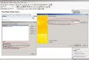
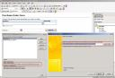

Today I had this weird problem: I downloaded a custom workflow sample which has an InfoPath form. The infopath form has a data source which retrieves using a web service. Since the form was already designed the web service URL used to set up the 'Retrieve data source' was some what like : http&#x3A;//localhost/\_vti_bin/ExternalSystemService.asmx?WSDL

Even when I tried to modify the data source by giving my own web service url(http&#x3A;//myspsite:port), it still shows that web service url is pointed to the localhost. Because there is no web service running on my localhost website the form fails in preview mode and of course fails in SharePoint once it is published to a forms library. See the screen shot below:

Doing a quick search, I found this [KB article](http://support.microsoft.com/kb/827003) which is related to InfoPath 2003. According to it the way to change the web service url is to extract the infopath forms files and edit the manifest xml file. Going about in this direction, for InfoPath forms 2007, just save the InfoPath forms as source files using 'File > Save as Source Files' menu. Then edit the manifest.xsf file in notepad, search for localhost and replace it with your own service url:port. Then right click the same file and select Design and you will the data source now shows the correct web service url.

