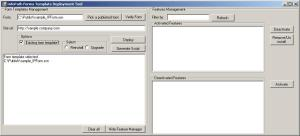

This tool is an effort towards helping all those who are working on InfoPath Forms with SharePoint. It helps to upload/install, re-install, upgrade a form template with just a click of the button. The tool also can help in generating a script/batch file so that you can run it manually later on. Also, the tool has 'Feature Management' addon, using which you can see a list of activated and deactivated features using a filter if needed. It also provides the ability to activate, deactivate and uninstall a feature. You can get the tool and read more about it at <http://www.codeplex.com/InfoPathFormsInstall> Please let me know of the bugs and enhancements if anyone uses it. Below is the screen shot of the tool:

\[caption id="attachment_65" align="alignnone" width="300" caption="InfoPath Form Template Deployer"]\[/caption]