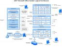

I stumbled upon this image in one of the msdn forms. This image grabbed my attention at once because in single image it encompassed all the components for Windows SharePoint Services(WSS), MS Office SharePoint Server 2007(MOSS) and the various dependent components and add-on servers. Keep this handy to answer any quick question by your friend or a business user.

I found this MOSS logical architecture diagram from msdn available in visio and XPS format.

<http://www.microsoft.com/downloads/details.aspx?FamilyID=14c6b1c1-ad26-4ed0-87b8-b691ebdd9662&displaylang=en#filelist>

Below is the JPEG format of the same:

