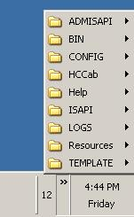
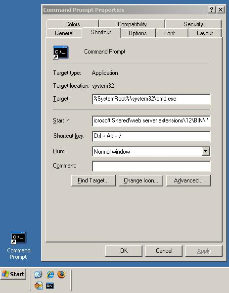

Every SharePoint developer needs to have quick access to the 12 Hive, 12Hive/Bin for the stsadm for various purposes in our daily development work. But, I have seen many of them never try to make this process easier. Even though this is a trivial issue, sometimes its pretty annoying. So here are a few ways to avoid those annoying moments. (\*12 Hive = C:\\Program Files\\Common Files\\Microsoft Shared\\web server extensions\\12\\)

1\. Add a shortcut link to the 12 Hive folder in the task bar.Just open the windows explorer and navigate to 12 Hive. Drag the left top corner icon and drop it on the task bar in the right corner. The end result is as follows: 

2\. Create a shortcut to the command prompt and set the default directory to the 12 Hive's BIN directory. Add that shortcut to the quick launch bar so that it would be one click away. Even better, you can set shortcut key to open up the command prompt. Set the Target, Start in properties as following: 

3\. Add the 12 Hive to your "Favorites" in the explorer window.

4\. To have access to stsadm.exe command irrespective of the folder you are in. Update the "Path" environment variable to add the path to the 12 Hive/BIN folder. (Right click My Computer - Go to Advanced Tab - Click Environment Variable , under system variables, edit Path variable and append the 12Bin path using semicolon as a delimiter). 

5\. This is yet another good one posted by Daniel in the comments:

"I usually create a junction point (officially a ntfs reparse point) in the file system using the junction tool from sysinternals (http&#x3A;//technet.microsoft.com/en-us/sysinternals/bb896768.aspx)

junction.exe c:\\wss “C:\\Program Files\\Common Files\\Microsoft Shared\\web server extensions\\12\\”

That gives me something like c:\\wss pointing to the 12 hive and stsadm.exe under c:\\wss\\bin.

(I do the same for the Windows Debugging tools and create a junction for them under c:\\Debug.)"

If you have any more options to make a developers life even more better and easier, please add to the comments.