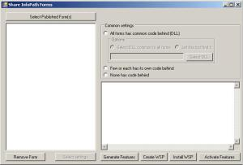

**Project Description** Share InfoPath Forms Tool helps make those rigid InfoPath forms sharable in SharePoint. Deployment of InfoPath Forms was never an easy task. Unlike the traditional approach of installing as a form template using stsadm commands, this tool packages delivers a WSP easing deployment.

You can download it from: <http://shareinfopathforms.codeplex.com/> ****

**Project Details** _-History:_ I worked on a project were we had to design and deploy around 200 InfoPath forms. And each form has code behind too. So deployment of each form through Central Admin is ruled out. The next best thing we can do was using the stsadm commands. Yes, it did helped ease our job. Thus I went ahead and I built a tool which generates and/or run those stsadm commands for a given form. This tool has been on codeplex since a long time. You can get it at: http&#x3A;//infopathformsinstall.codeplex.com. But then it wasn't enough. Why?

_-Why:_ Why did I develop this tool then? It is because even though the stsadm commands helped me solve the problem it wasn't the best solution. Those commands run forever to complete, its CPU intensive and boring to death. So after some hiatus I found out how easy it was install those forms as a WSP solution and that is the 'why' this tool is developed.

_-Whom:_ To whom is this tool targeted? This tool was initially developed to give it to the SharePoint administrators so that they can deploy all those forms at once. And also, they can activate those forms with a single click. Nonetheless this tool can be used by a SharePoint developer for deploying a form in the local dev environment.

_-How:_ How to use this tool? Please see the screen shot below. Below are steps in brief:

1\. Foremost point, this tool has to be executed by placing it on the server with SharePoint/MOSS installed on it. 2. Select all the published forms from your local drive or the network shared location. 3. If you don't want to publish few of those forms you can remove them off the list using the 'remove form' button below. 4. InfoPath forms may or may not have code behind. In our case all the forms has the code behind but we developed the code in such a way that all the forms point to the same DLL. So in the common settings panel in the right you have to select if your forms has code behind and if you know the path to the DLL. If not just allow the tool to find out the DLL. How does the tool find out the DLL? Read it below. 5. Firstly hit the 'Generate Features' button which will generate the 12 Hive/Root structure in the output folder within the project directory. You can check out those feature folders under Output/12/TEMPLATE/FEATURES/ 6. Next you hit the 'Create WSP' which will create the WSP for all those features and place the WSP file in the Output folder. 7. You can install the WSP right from this tool but that your choice. Once you hit the 'Install WSP' button it will prompt you for the site collection URL. 8. Deployment is one complete process and then the next step would be to activate each form from the site collection features page. So, to avoid that you can hit the 'Activate Features' button which will activate all those forms which are just installed. This could be a little bit time consuming and CPU intensive.

**Enhancements to be released** Below are the items still under development: \* Create a SharePoint form library and enable the library to inherit a form content type. \* Associate an uploaded form template with a form library. \* Other settings (remove New Folder, Open in browser etc) \* Attach Workflow to the form content type. A workflow manager is almost ready to be released. Expect next week.

Download the tool: <http://shareinfopathforms.codeplex.com/>